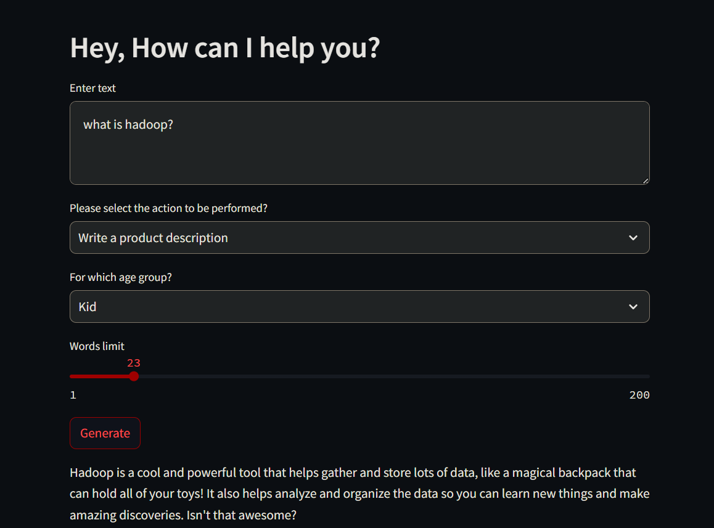

# Natural Language Marketing Assistant



## Overview

The AI Content Generator is a tool that leverages state-of-the-art language models to assist in content creation for
marketing purposes. With this tool, users can input prompts or queries, specify the target age group, and select the
type of content they want to generate. The tool then utilizes OpenAI's language model to generate relevant and engaging
responses tailored to the user's requirements.

## Features

- **Age-based Content Customization**: Choose from different age groups (Kid, Adult, Senior Citizen) to customize the
  tone and style of the generated content.

- **Task-specific Content Generation**: Select from various tasks such as writing sales copies, creating tweets, or
  writing product descriptions to generate content tailored to specific marketing needs.

- **Interactive User Interface**: The tool features an intuitive user interface powered by Streamlit, making it easy and
  straightforward to input queries and view generated responses.

## How It Works

1. **Input Query**: Users enter their query or prompt into the text input area.

2. **Age Group Selection**: Users select the target age group for the content generation.

3. **Task Type Selection**: Users choose the type of content they want to generate (e.g., sales copy, tweet, product
   description).

4. **Generate Content**: Upon clicking the "Generate" button, the tool utilizes OpenAI's language model to generate a
   response tailored to the input query, age group, and task type.

5. **View Generated Content**: The generated content is displayed to the user, providing them with relevant and engaging
   marketing content.

## Usage

1. **Clone Repository**: Clone this repository to your local machine.

2. **Install Dependencies**: Ensure you have Python installed, and then install the required dependencies listed in
   the `requirements.txt` file.

3. **Run Application**: Run the application by executing the main script (`app.py`) using Python.

4. **Interact with UI**: Use the interactive user interface to input queries, select age groups, choose task types, and
   generate content.

5. **View Generated Content**: The generated content will be displayed within the user interface, ready for use in
   marketing materials or campaigns.

## Contribution

Contributions to the AI Content Generator are welcome! If you have ideas for new features, improvements, or bug fixes,
feel free to open an issue or submit a pull request.

## License

This project is licensed under the [MIT License](LICENSE).


------------

**Running streamlit:**

To launch streamlit, use the following command:

```bash
python -m streamlit.cli run app.py
```

----------------


**Running Jupyter Notebook:**

To launch the Jupyter Notebook server, use the following command:

```bash
jupyter notebook
```

(Note: Use Control-C to stop the server)

---

**Installing Dependencies:**

Ensure that the required dependencies are installed by running the following commands:

```bash
pip install -r requirements.txt
python -m pip install jupyter
```

---

**Memory Profiling:**

To profile the memory usage, decorate your Python script with `@memory_profiler.profile` and run the following command:

```bash
python -m memory_profiler main.py
```

---

**Line Profiling:**

For line-level profiling, use the `line_profiler_pycharm` package. Decorate your Python script with `@profile` and
execute the following command:

```bash
python -m line_profiler main.py.lprof > results.txt
```

Make sure to replace `main.py` with the appropriate filename.